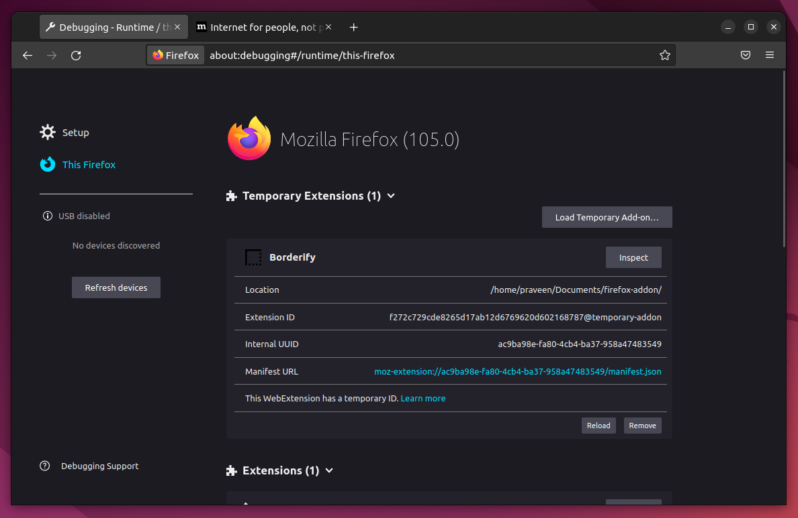

# Firefox Addons

https://developer.mozilla.org/en-US/docs/Mozilla/Add-ons/WebExtensions/Your_first_WebExtension

## Browser Extensions

Extensions, or add-ons, can modify and enhance the capability of a browser. Extensions for Firefox are built using the WebExtensions API cross-browser technology.

The technology for extensions in Firefox is, to a large extent, compatible with the extension API supported by Chromium-based browsers (such as Google Chrome, Microsoft Edge, Opera, Vivaldi). In most cases, extensions written for Chromium-based browsers run in Firefox with just a few changes.

# Load an addon

